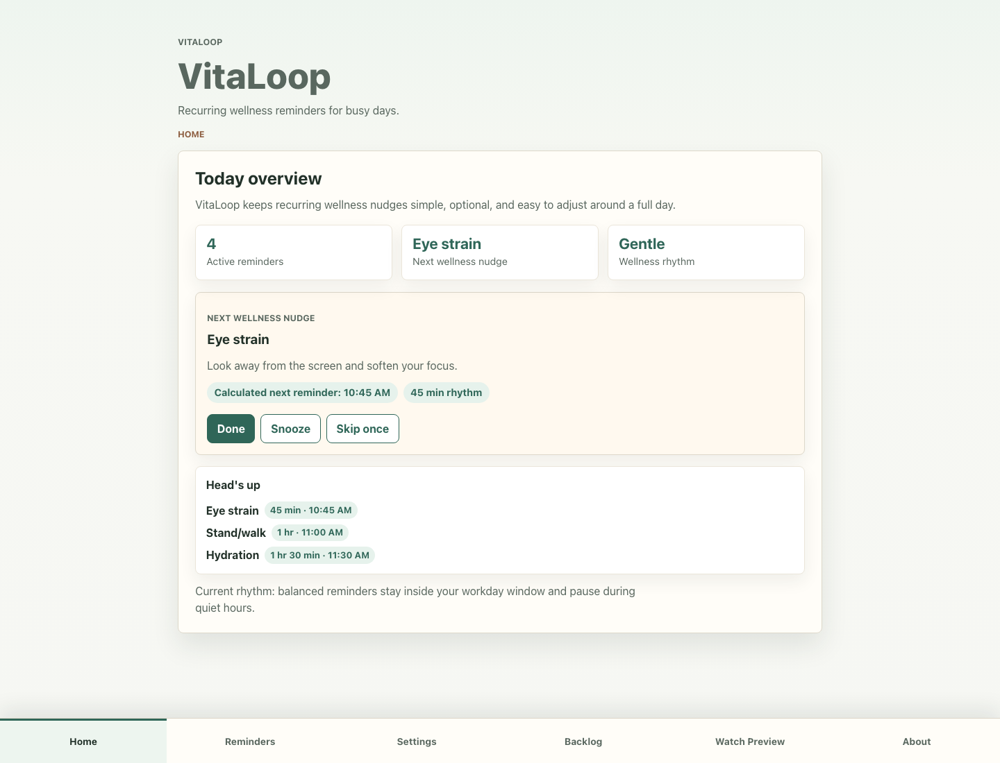
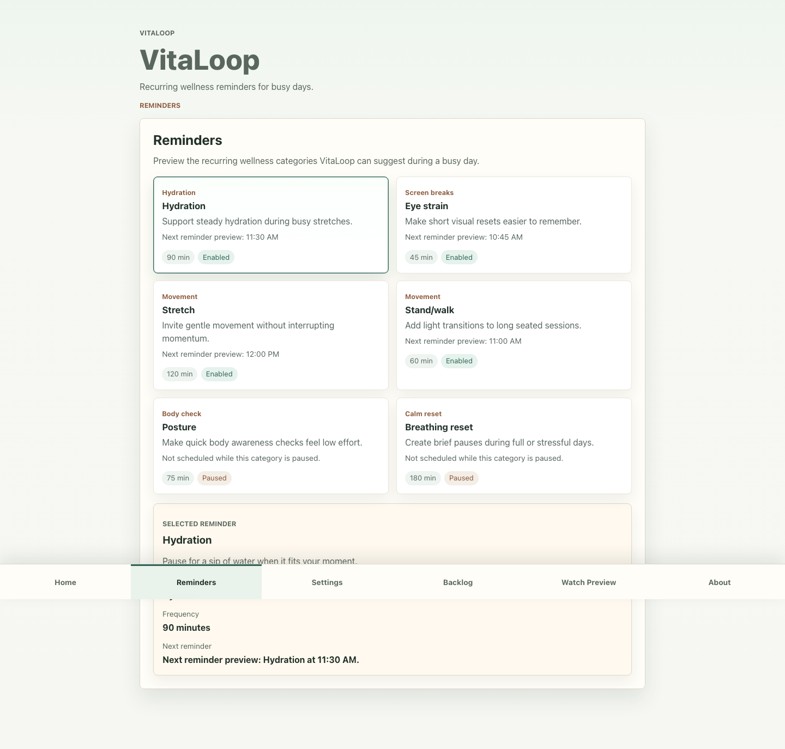
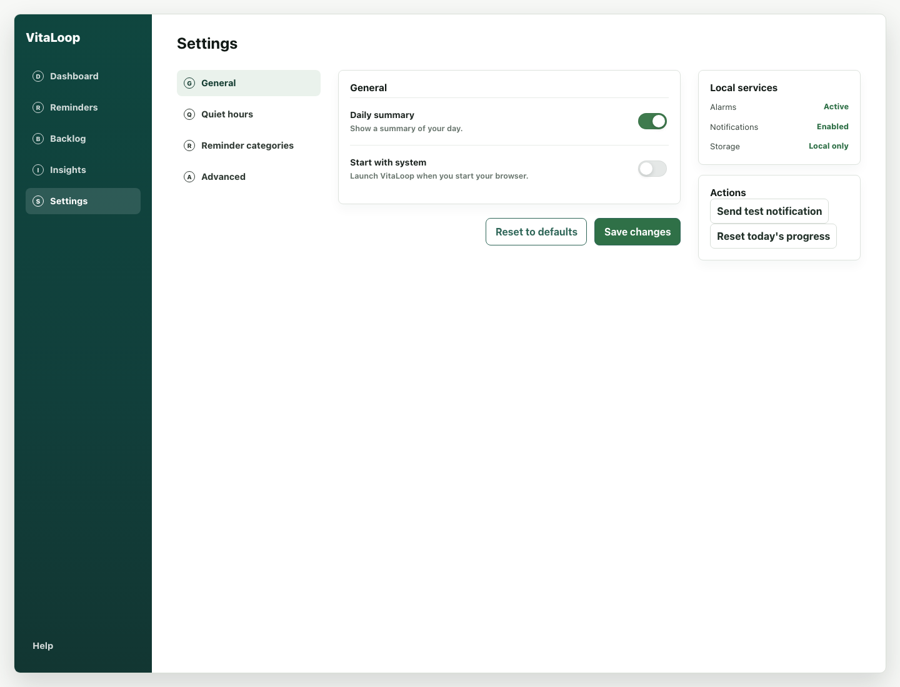
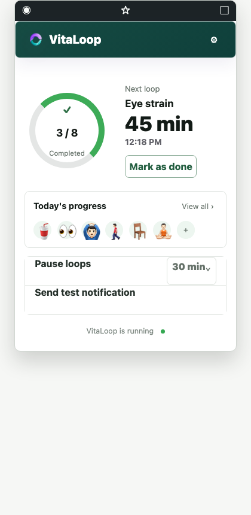
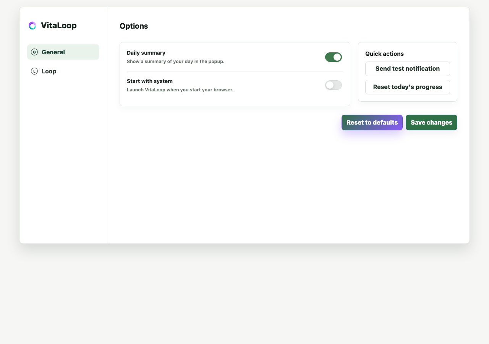

# VitaLoop

[](https://github.com/KhaledElzarw/VitaLoop/actions/workflows/ci.yml)

Small loops for better days.

VitaLoop is a calm, local-first wellness companion for the moments that disappear inside a busy day. It turns everyday self-care intentions into lightweight, recurring nudges that are easy to complete, snooze, skip, or tune around real life.

VitaLoop supports general wellness routines. It is not a medical app and does not provide medical advice, diagnosis, treatment, prevention claims, or emergency guidance.

## Product at a glance

VitaLoop is designed for people who spend long stretches focused on work, study, travel, caregiving, or screens and want a little more structure without another demanding tracking system.

- Notice the next small action with a clear home view and countdown.
- Build a personal rhythm across hydration, eye breaks, stretching, standing or walking, posture, breathing resets, sleep routines, and mood or energy check-ins.
- Keep control with quiet hours, workday windows, reminder intensity, preferred categories, and custom reminders.
- Act in the moment with done, snooze, and skip-once actions.
- Extend the same reminder model into a Chromium browser companion with opt-in local notifications.

## The product journey

The core loop is intentionally simple: see what is next, choose what fits, then make the reminder yours.

### 1. See the day at a glance

The home view surfaces the next wellness nudge, the current rhythm, and the upcoming “Head's up” queue without turning the day into a dashboard of scores.



### 2. Explore and choose reminders

The Reminders screen makes the available categories legible, shows their calculated schedule, and provides a focused detail view for the selected loop.



### 3. Tune the rhythm around real life

Settings keep the user in control of timing, quiet hours, workday boundaries, reminder intensity, notification behavior, and custom loops. Preferences are stored locally in the current MVP.



## Companion surfaces

The Chromium extension is designed for low-friction moments during browser-heavy work. The popup provides an at-a-glance next loop and a direct completion action; the Options page exposes the controls needed for local notifications and reminder preferences.

| Browser popup | Extension options |
| --- | --- |
|  |  |

## Engineering overview

VitaLoop is a small, typed frontend with a shared domain model across the web app and browser extension.

- React 19, TypeScript, and Vite provide the application and build foundation.
- `src/domain/` contains pure scheduling, reminder-action, history, schema, and custom-reminder logic.
- Zod schemas validate reminder definitions and application settings at the storage boundary.
- `src/services/` provides local persistence adapters for settings and reminder history.
- `src/extension/` contains the Manifest V3 popup, Options page, background scheduler, notification copy, and extension storage adapter.
- `public/manifest.json` defines the Chromium extension package and its narrowly scoped `storage`, `alarms`, and `notifications` permissions.
- Vitest and React Testing Library cover scheduling, storage fallback, reminder actions, settings validation, extension behavior, and core screen rendering.
- Capacitor is configured as a future packaging path for iOS and Android without generating native projects in the current web MVP.

The central design constraint is shared behavior: the web experience and extension consume the same reminder definitions, settings model, scheduling helpers, and action semantics instead of maintaining separate implementations.

## Privacy and safety boundaries

The current product is local-first by design:

- Settings, custom reminders, reminder actions, and recent history stay in browser-local storage.
- There are no accounts, backend services, cloud sync, analytics SDKs, payment flows, external APIs, content scripts, host permissions, or page reading.
- Browser notifications are opt-in and controlled by the user's browser and operating system.
- Reminder language remains supportive and optional; VitaLoop does not claim to prevent, treat, diagnose, or cure health conditions.

See [`docs/product-brief.md`](docs/product-brief.md) for the product vision, MVP boundaries, non-goals, and future platform direction. See [`docs/extension-notification-reliability.md`](docs/extension-notification-reliability.md) for the manual notification validation checklist and browser/OS limitations.

## Run locally

Requirements: Node.js 20 or newer and npm.

```bash
npm install
npm run dev
```

Open the local Vite URL shown in the terminal. The web app includes Home, Reminders, Settings, Backlog, Watch Preview, and About surfaces.

## Build and validate

The repository keeps the release checks intentionally small and reproducible:

```bash
npm run lint
npm test -- --run
npm run build
```

`npm run build` type-checks the project before producing the web app and Chromium extension artifacts in `dist/`. Build output is ignored by Git and should not be committed.

## Load the Chromium extension locally

The extension is an opt-in Manifest V3 MVP for Chromium-based browsers such as Chrome, Edge, Brave, Atlas, and compatible browsers.

1. Run `npm run build`.
2. Open the browser's extension management page, such as `chrome://extensions` or `edge://extensions`.
3. Enable Developer mode and choose **Load unpacked**.
4. Select the repository's `dist/` folder.
5. Open VitaLoop Options, enable proactive reminders, and save.
6. Use **Send test notification** to verify the browser notification path.
7. Open the popup to verify the next loop, progress surface, and done action.

Native notification layout and timing are controlled by the browser and operating system. Focus modes, notification permissions, browser policy, and platform behavior can affect whether a banner appears or stays visible.

## Project status and next steps

The repository is an intentionally scoped product foundation: the core web journey, local-first settings model, scheduling helpers, custom reminders, reminder actions, and Chromium extension MVP are implemented and covered by automated tests.

The product backlog keeps future work explicit, including mobile packaging, a native Apple Watch companion, and additional product polish. Native iOS, Android, and watchOS source is not included until those surfaces are ready for platform-specific validation.

## Contributing

Keep changes focused and maintain the product boundaries described above. For behavior changes, add or update focused tests, run lint, the full test suite, and the production build, and keep user-facing copy supportive, optional, and wellness-safe.

## License

No open-source license has been selected for this repository yet. Until a license is added, GitHub visibility does not grant permission to reuse, modify, or redistribute the source.
